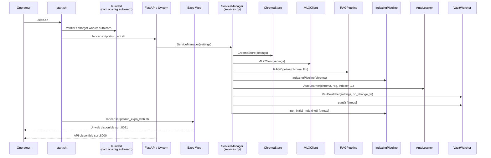
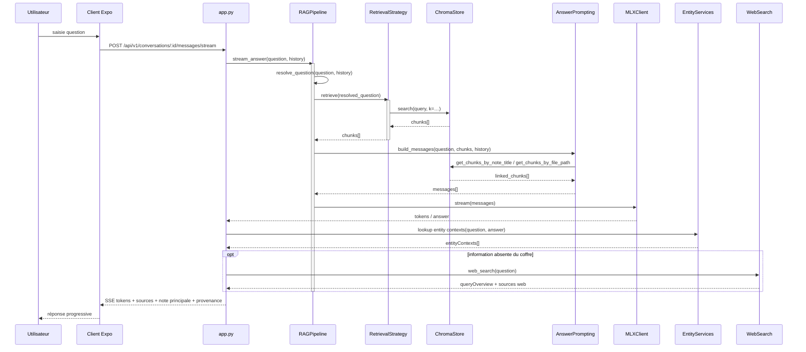
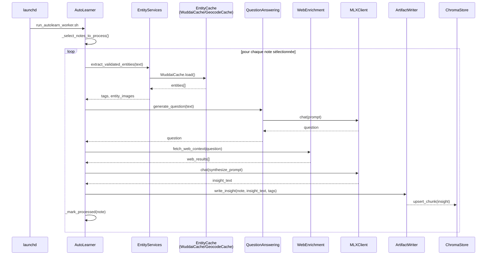
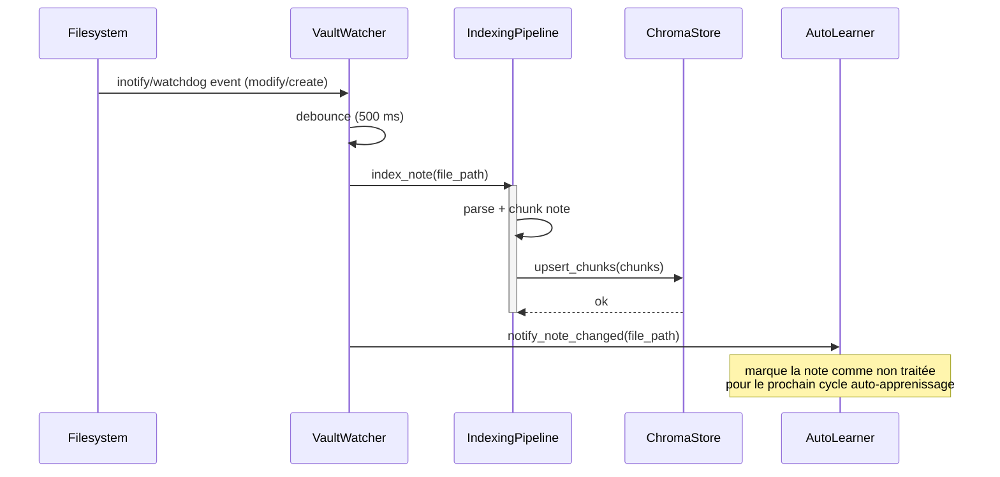

# Séquences ObsiRAG

Ce document décrit, sous forme de diagrammes de séquence simplifiés, les quatre flux principaux du système : démarrage opérationnel, requête chat, cycle auto-apprenissage, et événement watcher. Il complète `architecture.md` en en détaillant les interactions runtime entre composants.

---

## 1. Démarrage opérationnel

---

## 2. Requête chat (pipeline RAG complet)

---

## 3. Cycle AutoLearner (worker persistant)

---

## 4. Événement VaultWatcher (modification d'une note)

---

## Note d'architecture

Les séquences ci-dessus décrivent le runtime principal actuel : `launchd` pour le worker auto-learner persistant, FastAPI pour le backend applicatif, et Expo web pour l'interface principale. Les flux historiques de l'ancienne UI ne sont plus la référence opératoire du produit.
