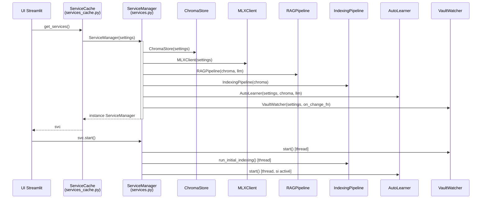
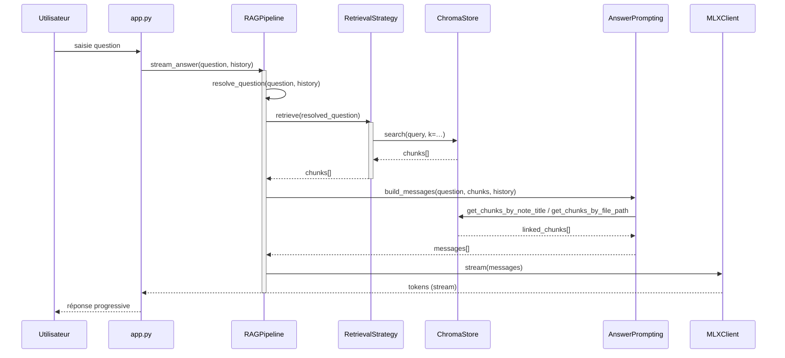
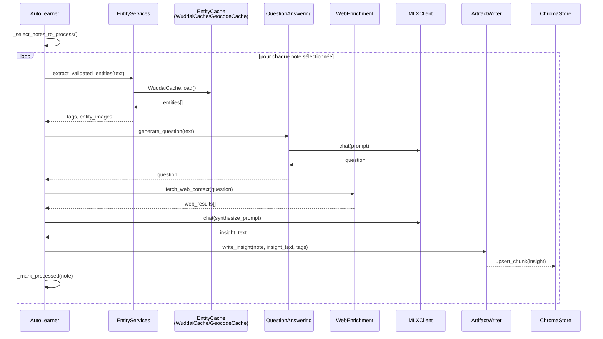
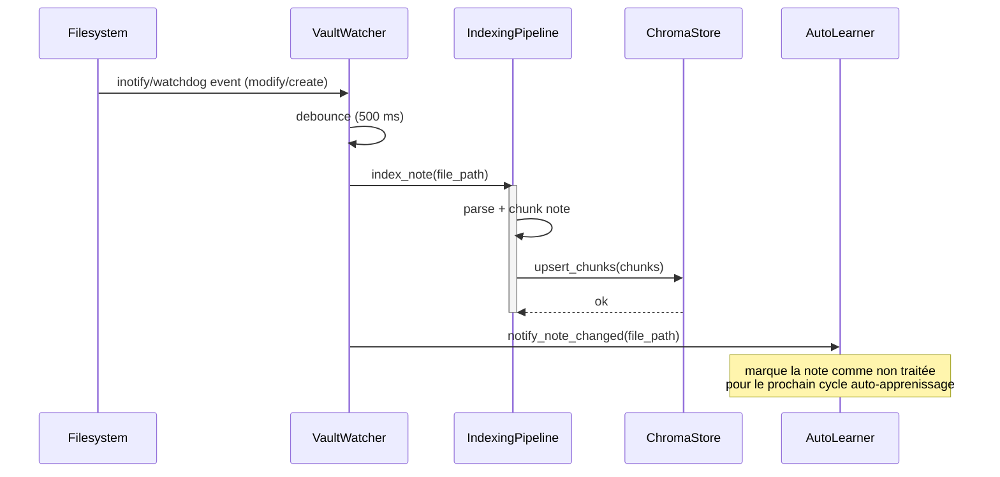

# Séquences ObsiRAG

Ce document décrit, sous forme de diagrammes de séquence simplifiés, les quatre flux principaux du système : démarrage, requête chat, cycle auto-apprenissage, et événement watcher. Il complète `architecture.md` en en détaillant les interactions runtime entre composants.

---

## 1. Démarrage de l'application

---

## 2. Requête chat (pipeline RAG complet)

---

## 3. Cycle AutoLearner (traitement d'une note)

---

## 4. Événement VaultWatcher (modification d'une note)

