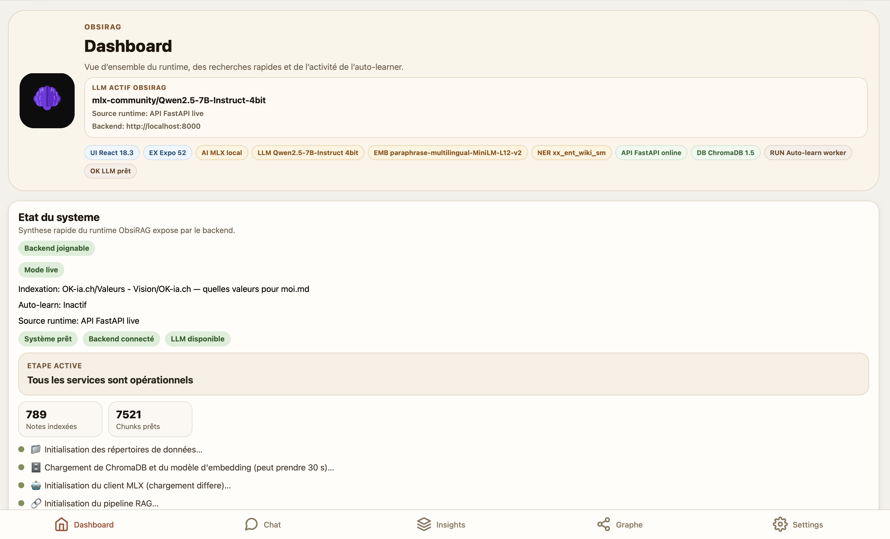
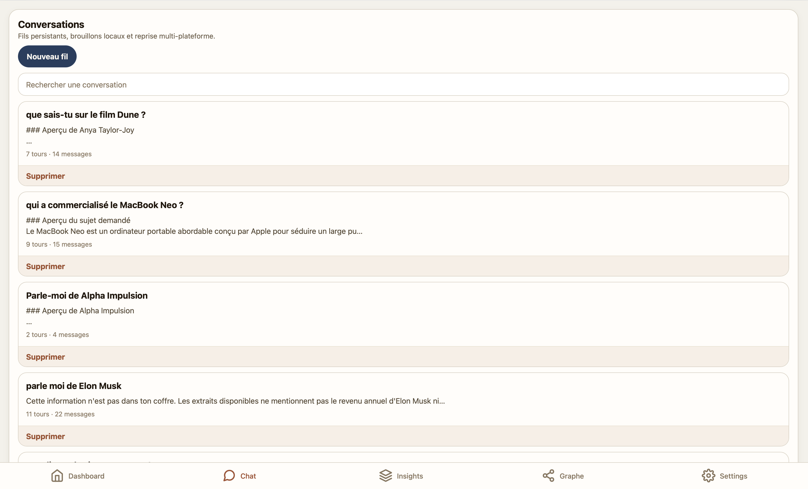
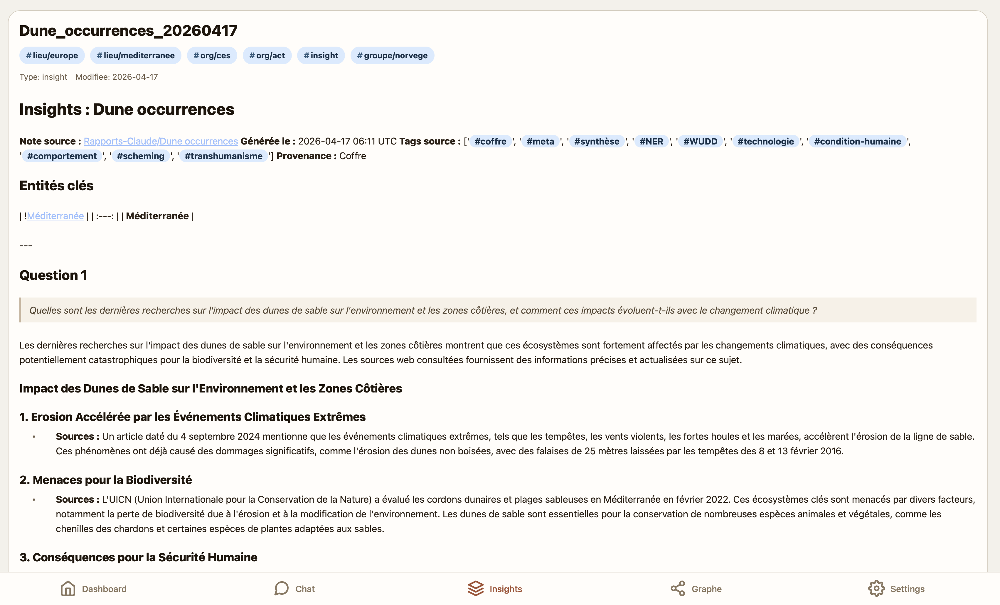

# ObsiRAG Expo

Client Expo Router pour la reecriture d'ObsiRAG en React Native + TypeScript.

## Objectif

Ce sous-projet fournit l'interface produit principale actuelle d'ObsiRAG, basee sur Expo web. Il fournit notamment :

- Expo Router
- React Query
- Zustand persistant
- client API deja structure
- ecrans MVP conformes a la specification produit

Le backend RAG Python n'est pas reimplementé ici. Le projet est concu pour etre branche a une API ObsiRAG exposee en HTTP/SSE.

## Fonctionnellement inclus

- configuration serveur
- dashboard systeme
- liste des conversations
- detail de conversation avec streaming SSE backend ou fallback mock
- selection du provider par conversation (`MLX` local ou `Euria`)
- affichage des sources, de la note principale, du provider effectif et de la provenance coffre/web/hybride
- recherche sur le web via le backend avec resume de requete et sources DDG
- affichage des contextes d'entites detectees (NER) renvoyes par l'API
- liste des insights
- detail d'insight
- vue graphe avec filtres, recherche texte, spotlight et notes recentes
- vue note avec retour vers la conversation d'origine si ouverte depuis le chat
- settings avec theme, taille du texte et diagnostics runtime

## Apercu visuel

### Dashboard systeme

La capture ci-dessous est la meilleure illustration de l'ecran de pilotage runtime : etat du backend, disponibilite du LLM, indexation, metriques et activite auto-learner.



### Liste des conversations

Cette capture se place naturellement avec les fonctionnalites de fil de discussion : reprise multi-tour, recherche locale et suppression d'un fil.



### Detail d'un insight

Cette capture complete la section Insights : on y voit la provenance, les tags, les entites detectees et le rendu question/reponse de l'artefact.



## Lancer le projet

```bash
cd obsirag-expo
npm install
npm run start
```

Puis :

- `i` pour iOS
- `a` pour Android
- `w` pour web

Pour lancer directement le GUI web depuis la racine du depot :

```bash
./scripts/run_expo_web.sh
```

Pour produire un build web statique servi ensuite par l'API FastAPI :

```bash
cd obsirag-expo
npm run web:export
```

URL du GUI web : `http://localhost:8081`

URL du backend API : `http://localhost:8000`

Depuis la racine du depot, le cycle de vie recommande est :

```bash
./start.sh
./status.sh
./stop.sh
```

`./start.sh` relance l'API FastAPI. Si `obsirag-expo/dist/index.html` existe, l'API sert directement le frontend web statique sur le meme port que le backend. Sinon, le script garde le mode de developpement Expo web sur `:8081`. L'auto-learner reste gere a part via `launchd` et `./install_service.sh`.

## Build iOS / TestFlight

Le projet inclut maintenant une base `eas.json` et une config Expo dynamique via `app.config.js` pour preparer les builds iOS.

Avant un build TestFlight, ajuste au minimum :

- `OBSIRAG_IOS_BUNDLE_IDENTIFIER`,
- `OBSIRAG_IOS_BUILD_NUMBER`,
- `EXPO_PUBLIC_DEFAULT_BACKEND_URL` ou `API_PUBLIC_BASE_URL`,
- les credentials Apple relies a ton compte developpeur.

Exemple local :

```bash
cd obsirag-expo
export OBSIRAG_IOS_BUNDLE_IDENTIFIER=com.ton-domaine.obsirag
export OBSIRAG_IOS_BUILD_NUMBER=1
export EXPO_PUBLIC_DEFAULT_BACKEND_URL=https://obsirag.ton-domaine.tld
```

Exemples :

```bash
cd obsirag-expo
eas build --platform ios --profile preview
eas build --platform ios --profile production
eas submit --platform ios --profile production
```

Pour iOS, il est recommande d'utiliser une URL backend distante stable plutot que `localhost`.

## Session et backend

Le store local demarre desormais en mode live avec une API ObsiRAG sur `http://localhost:8000`.

Au demarrage, le client verifie la session via `/api/v1/session`. Si l'ecran `server-config` est atteint alors qu'une session valide existe deja, il redirige automatiquement vers `/(tabs)`. Quand cet ecran est ouvert volontairement depuis `Settings`, il reste en place grace au parametre `allowStay=1`.

Les endpoints principaux deja exploites par le client sont :

- `/api/v1/session`
- `/api/v1/system/status`
- `/api/v1/conversations`
- `/api/v1/conversations/:id/messages`
- `/api/v1/conversations/:id/messages/stream`
- `/api/v1/notes/search`
- `/api/v1/graph` et `/api/v1/graph/subgraph`
- `/api/v1/web-search`

Les requetes de chat et de recherche web peuvent transporter `useEuria: true` pour demander explicitement le provider Euria. Le backend renvoie alors aussi `llmProvider` sur les messages et les reponses web, ce que l'UI affiche dans les badges de fil.

Si tu veux revenir en mode mock :

1. ouvrir `Settings`,
2. utiliser `Basculer en mock`.

Si ton backend exige un token :

1. ouvrir l'ecran de configuration serveur,
2. renseigner l'URL du backend,
3. saisir le token,
4. enregistrer la session.

Si tu veux activer Euria cote backend, configure aussi les variables serveur `EURIA_URL` et `EURIA_BEARER` dans le depot principal avant de lancer l'API.

## Reglages d'interface

L'ecran `Settings` expose maintenant :

- le theme global,
- la taille du texte (`Petite`, `Standard`, `Grande`) via deux actions rapides `zoom-out` et `zoom-in`,
- le statut runtime du backend,
- la verification de session,
- l'acces manuel a la configuration serveur sans casser le bootstrap normal.

## Mode mock

Le mode mock reste disponible pour travailler sans backend.

1. ouvrir l'ecran de configuration serveur,
2. activer `Utiliser le backend mock`,
3. renseigner l'URL du backend,
4. ou revenir ensuite en mode live.

## Structure

- `app/` : routes Expo Router
- `components/` : composants UI et metier
- `features/` : hooks et logique d'ecran
- `services/api/` : client API et mocks
- `services/storage/` : persistance securisee
- `store/` : etat local persistant
- `types/` : contrats TypeScript
- `spec/` : elements importables et complements

## Documents de reference

- `../docs/react-expo-specification.md`
- `spec/project-brief.md`
- `spec/api-contract.md`

## Prochaines etapes conseillees

1. etendre encore la propagation de la taille de texte aux derniers ecrans secondaires
2. ajouter des tests e2e sur la selection de provider et le bootstrap `server-config`
3. enrichir la navigation du graphe et des sources
4. consolider la documentation des contrats API Expo/FastAPI
